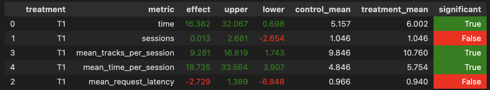

# Отчёт по домашнему заданию по рекомендательным системам в MADE

Основано на исходном репозитории https://github.com/anokhin/recsys-itmo-spring-2023, пожалуй, проще было бы сделать pull-request.


## Интструкция по запуску
- Все как в оригинальном репозитории. Клонируем, создаем докер для botify (см. readme там), окружение для sim. Я использовал Python 3.9.15, чтобы запустилось, немного поменял `requirements.txt`.
```
pip install virtualenv
python -m virtualenv simenv
source simenv/bin/activate
pip install pip==22.0.4
pip install setuptools==58.1.0
``` 
-дополнительные команды для sim.
- Модель обучалась в `jupyter/Week4Seminar_our.ipynb`, кладем рекомендации в `botify/data/tracks_with_recs_our.json`
- Относительно исходного кода, поменялись файлы в `botify/botify`, чтобы использовать новую модель (по итогу оставил contextual), contextual в качестве control модели и чтобы каждая модель подгружала свои данные.
- Поднимаем botify, запускаем sim (например, в однопоточном режиме), получаем данные, копируем их в папку `tmp`, например `docker cp recommender-container:/app/log/ ../tmp/`
- Делаем анализ в `jupyter/Week1Seminar_our.ipynb`

## Отчёт
### Основные идеи и детали
- Я первая мысль была заменить поэлементное умножение векторов эмбеддингов на косинус между ними. По итогу, другие мои простые идеи лучше не сработали. 
- Еще я увеличил размер эмбеддинга со 100 до 128 и 256
- Пробовал менять на скалярное произведение, лучше не стало, примерно такой же результат
- Пробовал сделать гиперболическое скалярное произведение и расстояние Лоренца - не получилось
- Стеканье векторов + небольшая FFNN с двумя слоями, релу результат не улучшило. Добавление сигмоды тоже.
- Замена MSE на MAE не помогла, перебор learning rate'а тоже.
- Эксперименты в `jupyter/Week4Seminar_our.ipynb`

### Результаты A/B теста
- Получил статистичеески значимый прирост по параметру `mean_time_per_session`
- A/B тест можно посмотреть в `jupyter/Week1Seminar_our.ipynb`



### Prerequisites

- Установить docker
- Сделать virtualenv c python 

### Общее описание задачи

Пользователи приходят в музыкальный сервис **botify**, чтобы послушать музыку.
Сперва пользователь сам выбирает начальный трек.
Когда пользователь прослушал этот трек, сервис рекомендует следующий.
Пользователь может послушать рекомендованный трек или скипнуть его и перейти к следующему.
Либо пользователю может надоесть и он уйдет.
Как поступит пользователь зависит от качества рекомендаций: если они плохие - пользователь быстро уйдет; если хорошие – "залипнет".
Последовательность прослушанных пользователем треков мы будем называть "сессией".
На диаграмме ниже показан процесс одной сессии.  

Цель сервиса **botify** – максимально долго удерживать пользователя.
Возможно, мы зарабатываем на рекламе или просто хотим набрать аудиторию.
Сервис меряет процент прослушки каждого трека из сессии и суммирует эти проценты, чтобы получить общую длину сессии (пренебрегаем тем, что треки могут длиться разное время – обычно песни длятся около 3 минут).
Качество рекомендаций напрямую влияет на то, сколько треков послушают пользователи и какой будет процент их прослушки.
Следовательно качество рекомендаций влияет на длину сессии и на успех всего сервиса в целом.

### Что есть в репозитории

#### botify

В этом модуле лежит заготовка сервиса рекомендера. 
В рамках заданий работать нужно будет над кодом из этого модуля.

[Описание и инструкции](botify/README.md)

#### sim

Так как наш рекомендер учебный, он не развернут для реальных пользователей. 
Но мы хотим экспериментировать с рекомендером как с настоящим.
Для этого в модуле sim реализован симулятор пользователя.
Запуская симулятор, мы генерируем трафик, похожий на трафик, который генерируют реальные пользователи.

[Описание и инструкции](sim/README.md)

#### jupyter

Ноутбуки с подготовкой данных для симулятора, визуализацией и всем таким.


